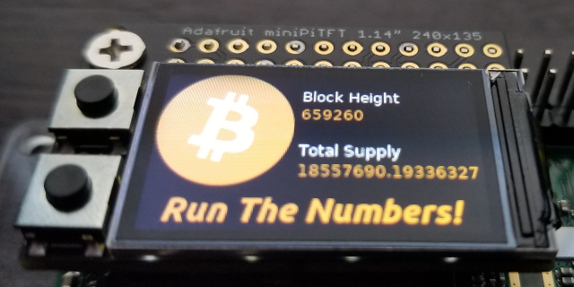
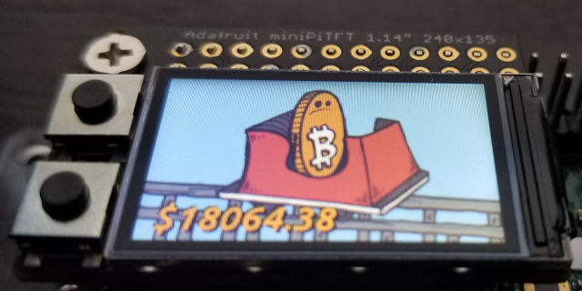
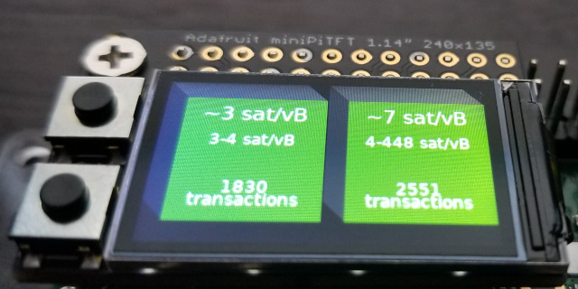
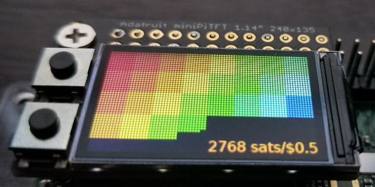

# pizero-minipitft

Scripts for Adafruit Mini Pi TFT

- [bitcoin.py](./bitcoin/bitcoin.py) - A script with multiple panels to display assorted bitcoin related interests.

## License

The custom code in this repository is licensed under the [MIT Licenese](LICENSE).
The script and guidance is based on works prepared by lady ada, Melissa LeBlanc-Williams of [Adafruit](https://learn.adafruit.com/)

## Prerequisites

Before using the scripts, you'll need to setup your Raspberry Pi.

A brief guide for [prerequisites](prereqs.md) can guide you through this

## BITCOIN.PY

| Panel # | Name | Image |
| --- | --- | --- |
| 1 | Run the Numbers |  |
| 2 | Rollercoaster Guy with Price |  |
| 3 | Mempool Blocks |  |
| 4 | Sats per Fiat Unit |  |

By default, the script operates in auto scan mode, displaying a panel for approximately 10 seconds before advancing to the next.  

The two buttons allow for manually selecting previous and next panel.  This deactivates auto scan mode.

Pressing both buttons simultaneously will re-activate auto scan mode.

The following three endpoints are referenced by this script

* https://mempool.space/api/v1/fees/mempool-blocks

  The API endpoint is called once every 2 minutes if the panel is active to update results.  Mempool blocks are based upon the general look and feel of that rendered at https://mempool.space/, focusing on the next two upcoming blocks.

* http://your.own.node:1839/the_numbers_latest.txt

  This endpoint is the [run the numbers service](https://github.com/lucasmoten/runthenumbers) that you can setup on your own node.  This is a separate project that stores the results of gettxoutsetinfo every 5 blocks.

* https://api.coingecko.com/api/v3/simple/price?ids=bitcoin&vs_currencies=usd

  This endpoint is the [Powered by CoinGecko API](https://www.coingecko.com/en), and provides for the current price of Bitcoin in USD. This is checked once every 5 minutes and used for both the roller coaster guy display, as well as the sats per fiat unit display.


## Download the Script and files

### Clone the repo

```bash
cd ~/
git clone git@github.com:lucasmoten/pizero-minipitft.git
cd ~/pizero-minipitft/bitcoin
```

### Review/Edit

```bash
nano bitcoin.py
```
You'll need to set the URL for your node for the numbersurl.

If you have your own mempool server v2 you can change the endpoint for mempoolurl


### Test run

```bash
cd ~/pizero-minipitft/bitcoin
sudo python3 bitcoin.py
```

Press CTRL+C to cancel the process. 

### Autorun on boot

If the Raspberry Pi is rebooted, you would normally need to ssh back in and start the script manually.
To start the script automatically on power on, you can make an entry in the /etc/rc.local to run it.

```bash
sudo nano /etc/rc.local
```

And then add this block before the last line (`exit 0`)

```ini
# Start the bitcoin script
(
  cd /home/pi/pizero-minipitft/bitcoin
  python3 /home/pi/pizero-minipitft/bitcoin/bitcoin.py &
)
```
Be certain that you include the ampersand at the end of the command to ensure it is started as a background process or else you may not be able to login.

Press CTRL+O to save. Test it out by rebooting.

```bash
sudo reboot now
```
After up to a minute, the pi should begin cycling through panels 